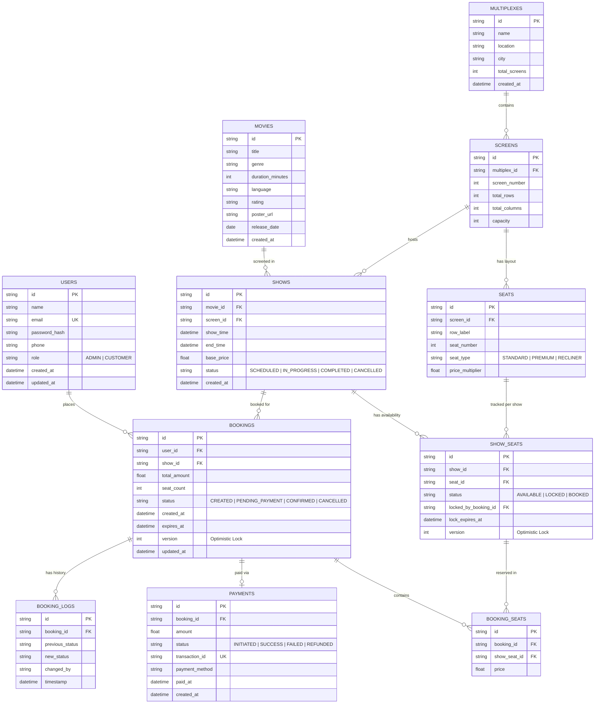

# CineBook — ER Diagram

## Overview

The ER diagram represents the database schema for the CineBook Movie Theatre Booking Engine. It covers users, multiplexes, screens, seat layouts, movies, shows, bookings, booking-seat mappings, and payments. Key concepts include optimistic locking (version fields), audit trails, and state persistence.

---

## Diagram

---

## Flow Summary

| Phase | Description | Key Concepts |
| :--- | :--- | :--- |
| **1. Data Integrity** | `USERS` stores `password_hash` instead of plain text; emails are unique. | **Hashing**, **Security Best Practices** |
| **2. Seat Management** | `SHOW_SEATS` tracks per-show seat availability separately from the static `SEATS` layout. | **Normalization**, **State Separation** |
| **3. Concurrency Control** | `SHOW_SEATS.version` and `BOOKINGS.version` enable optimistic locking for atomic updates. | **Optimistic Locking**, **Versioning** |
| **4. Booking Lifecycle** | `BOOKINGS.status` tracks the progression (CREATED → PENDING_PAYMENT → CONFIRMED → CANCELLED). | **State Persistence**, **Enum Mapping** |
| **5. Audit Trail** | `BOOKING_LOGS` records every status transition for accountability and debugging. | **Audit Logging**, **Event Sourcing (Lite)** |
| **6. Payment Tracking** | `PAYMENTS` table links to bookings with its own lifecycle (INITIATED → SUCCESS → FAILED → REFUNDED). | **Transaction Tracking**, **Idempotency** |
