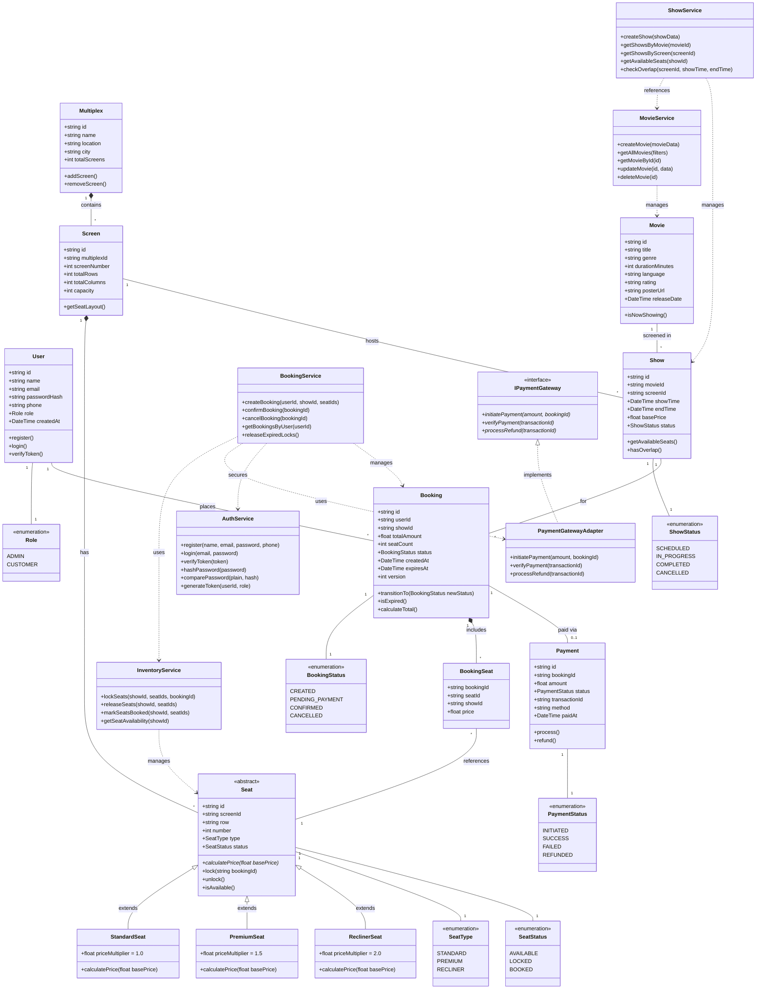

# CineBook — Class Diagram

## Overview

The class diagram represents the major classes in the CineBook Movie Theatre Booking Engine, their attributes, methods, and relationships. It highlights OOP principles (abstraction, inheritance, polymorphism) and design patterns (State, Adapter, Repository, Service Layer).

---

## Diagram

---

## Flow Summary

| Phase | Description | Key Patterns |
| :--- | :--- | :--- |
| **1. Modular Architecture** | Services (`AuthService`, `BookingService`, `ShowService`, `InventoryService`) are decoupled and follow single responsibility. | **Service Layer Pattern**, **Separation of Concerns** |
| **2. Secure Authentication** | `AuthService` handles JWT token generation and verification; role-based access restricts admin operations. | **RBAC**, **Token-Based Auth** |
| **3. Seat Abstraction** | Abstract `Seat` class with concrete implementations (`StandardSeat`, `PremiumSeat`, `ReclinerSeat`) each with polymorphic pricing. | **Abstraction**, **Inheritance**, **Polymorphism** |
| **4. Booking Lifecycle** | `Booking` status managed via `BookingStatus` enum with validated transitions (CREATED → PENDING_PAYMENT → CONFIRMED → CANCELLED). | **State Pattern**, **Enum Strategy** |
| **5. Payment Adapter** | `PaymentGatewayAdapter` implements `IPaymentGateway` to decouple the booking engine from third-party payment providers. | **Adapter Pattern**, **Dependency Inversion** |
| **6. Concurrency Control** | `InventoryService` locks seats atomically and uses versioning on `Booking` to prevent double-booking. | **Pessimistic Locking**, **Optimistic Locking** |
