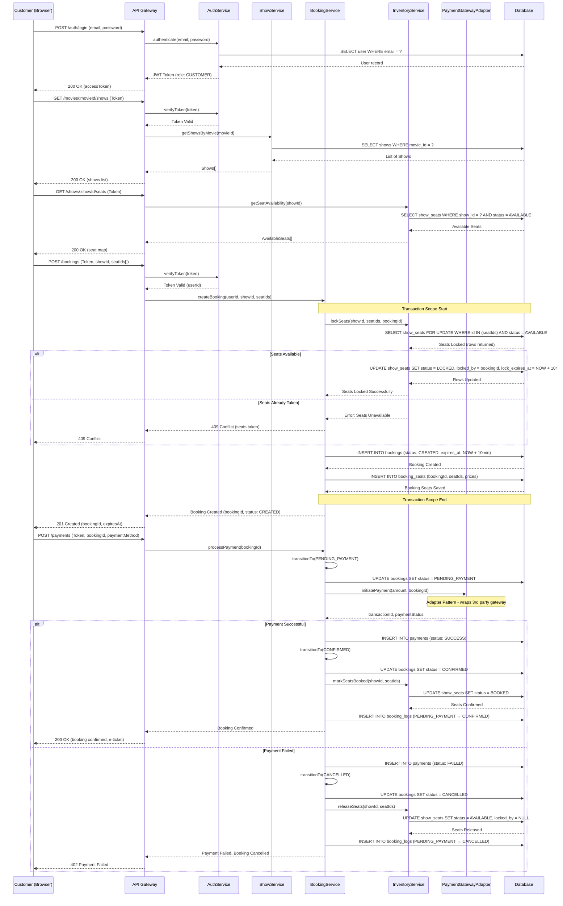

# CineBook — Sequence Diagram

## Overview

The sequence diagram illustrates the **main booking flow end-to-end** in the CineBook Movie Theatre Booking Engine. It covers authentication, seat availability check, seat locking (concurrency control), booking creation, payment processing via the Adapter Pattern, and booking confirmation — all within a transactional scope.

---

## Diagram

---

## Flow Summary

| Phase | Description | Key Patterns |
| :--- | :--- | :--- |
| **1. Secure Entry** | Request hits API Gateway → `AuthService` verifies JWT token and extracts user role. | **Token-Based Auth**, **RBAC** |
| **2. Browse & Select** | `ShowService` retrieves available shows; `InventoryService` provides real-time seat availability. | **Service Layer**, **Read Optimization** |
| **3. Seat Locking** | `InventoryService` uses `SELECT ... FOR UPDATE` to pessimistically lock seats, preventing double-booking. | **Pessimistic Locking**, **Concurrency Control** |
| **4. Booking Creation** | Booking and seat reservations saved within a single database transaction with TTL-based expiry. | **Transactional Safety**, **TTL-Based Locks** |
| **5. Payment Processing** | `PaymentGatewayAdapter` wraps the third-party payment API, decoupling the booking engine from external systems. | **Adapter Pattern**, **Dependency Inversion** |
| **6. State Transition** | Booking status transitions are validated (CREATED → PENDING_PAYMENT → CONFIRMED / CANCELLED) with audit logs. | **State Pattern**, **Audit Logging** |
