# CineBook — Use Case Diagram

## Overview

The use case diagram identifies the primary actors in the CineBook Movie Theatre Booking Engine and the key use cases they interact with. The two main actors are **Customer** and **Admin**, interacting with the system through authentication, browsing, booking, payment, and management functionalities.

---

## Diagram

```mermaid
graph TB
    subgraph Actors
        Customer["🎬 Customer"]
        Admin["🔧 Admin"]
    end

    subgraph CineBook System
        subgraph Authentication
            UC1["Register Account"]
            UC2["Login"]
            UC3["Verify JWT Token"]
        end

        subgraph Movie Browsing
            UC4["Browse Movies"]
            UC5["View Movie Details"]
            UC6["Search Movies by Genre/Language"]
        end

        subgraph Show & Seat Selection
            UC7["View Available Shows"]
            UC8["View Seat Layout"]
            UC9["Select Seats"]
        end

        subgraph Booking Management
            UC10["Create Booking"]
            UC11["Lock Seats Temporarily"]
            UC12["Confirm Booking"]
            UC13["Cancel Booking"]
            UC14["View Booking History"]
            UC15["Release Expired Locks"]
        end

        subgraph Payment
            UC16["Initiate Payment"]
            UC17["Process Payment via Gateway"]
            UC18["Handle Payment Failure"]
            UC19["Process Refund"]
        end

        subgraph Admin Management
            UC20["Manage Movies CRUD"]
            UC21["Manage Multiplexes"]
            UC22["Manage Screens & Seat Layout"]
            UC23["Schedule Shows"]
            UC24["View All Bookings"]
            UC25["View Revenue Analytics"]
        end
    end

    %% Customer Use Cases
    Customer --> UC1
    Customer --> UC2
    Customer --> UC4
    Customer --> UC5
    Customer --> UC6
    Customer --> UC7
    Customer --> UC8
    Customer --> UC9
    Customer --> UC10
    Customer --> UC13
    Customer --> UC14
    Customer --> UC16

    %% Admin Use Cases
    Admin --> UC2
    Admin --> UC20
    Admin --> UC21
    Admin --> UC22
    Admin --> UC23
    Admin --> UC24
    Admin --> UC25

    %% Include Relationships
    UC2 -.->|includes| UC3
    UC10 -.->|includes| UC11
    UC10 -.->|includes| UC9
    UC16 -.->|includes| UC17
    UC12 -.->|extends| UC10

    %% Extend Relationships
    UC18 -.->|extends| UC16
    UC19 -.->|extends| UC18
    UC15 -.->|extends| UC11

    %% System Auto-Trigger
    UC15 -.->|"auto-triggered (TTL expiry)"| UC11

    style Customer fill:#4CAF50,color:#fff,stroke:#388E3C
    style Admin fill:#2196F3,color:#fff,stroke:#1565C0
```

---

## Use Case Descriptions

### Customer Use Cases

| # | Use Case | Description |
| :--- | :--- | :--- |
| UC1 | Register Account | Customer signs up with name, email, phone, and password |
| UC2 | Login | Customer authenticates with email and password, receives JWT |
| UC4 | Browse Movies | Customer views currently showing movies |
| UC5 | View Movie Details | Customer sees movie info (genre, duration, language, rating) |
| UC6 | Search Movies | Customer filters movies by genre, language, or name |
| UC7 | View Available Shows | Customer sees showtimes for a selected movie |
| UC8 | View Seat Layout | Customer views the seat map with availability for a show |
| UC9 | Select Seats | Customer picks available seats (Standard / Premium / Recliner) |
| UC10 | Create Booking | Customer creates a booking for selected seats (triggers seat lock) |
| UC13 | Cancel Booking | Customer cancels a pending or confirmed booking |
| UC14 | View Booking History | Customer reviews past and current bookings |
| UC16 | Initiate Payment | Customer proceeds to pay for a created booking |

### Admin Use Cases

| # | Use Case | Description |
| :--- | :--- | :--- |
| UC20 | Manage Movies (CRUD) | Admin creates, updates, or deletes movie listings |
| UC21 | Manage Multiplexes | Admin adds or updates multiplex venues |
| UC22 | Manage Screens & Layout | Admin configures screens and seat layouts per screen |
| UC23 | Schedule Shows | Admin assigns movies to screens with date/time (no overlap) |
| UC24 | View All Bookings | Admin views booking records across all shows |
| UC25 | View Revenue Analytics | Admin sees revenue and occupancy per show/screen |

### System Use Cases

| # | Use Case | Description |
| :--- | :--- | :--- |
| UC3 | Verify JWT Token | System verifies token on every authenticated request |
| UC11 | Lock Seats Temporarily | System locks selected seats with TTL during booking |
| UC12 | Confirm Booking | System confirms booking after successful payment |
| UC15 | Release Expired Locks | System auto-releases seats when lock TTL expires |
| UC17 | Process Payment via Gateway | System delegates payment to adapter (3rd party simulation) |
| UC18 | Handle Payment Failure | System cancels booking and releases seats on payment failure |
| UC19 | Process Refund | System initiates refund on confirmed booking cancellation |

---

## Relationships Summary

| Relationship | From | To | Type |
| :--- | :--- | :--- | :--- |
| Login includes token verification | UC2 (Login) | UC3 (Verify Token) | **Include** |
| Booking includes seat selection | UC10 (Create Booking) | UC9 (Select Seats) | **Include** |
| Booking includes seat locking | UC10 (Create Booking) | UC11 (Lock Seats) | **Include** |
| Payment includes gateway processing | UC16 (Initiate Payment) | UC17 (Process via Gateway) | **Include** |
| Confirmation extends booking | UC12 (Confirm Booking) | UC10 (Create Booking) | **Extend** |
| Payment failure extends payment | UC18 (Handle Failure) | UC16 (Initiate Payment) | **Extend** |
| Refund extends failure handling | UC19 (Process Refund) | UC18 (Handle Failure) | **Extend** |
| Lock expiry auto-triggers release | UC15 (Release Locks) | UC11 (Lock Seats) | **Extend (system)** |
